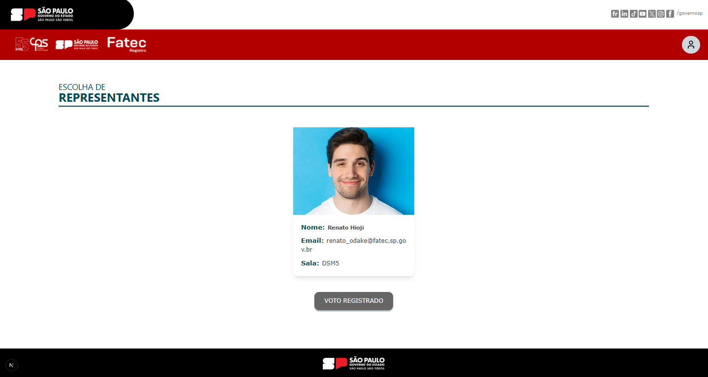
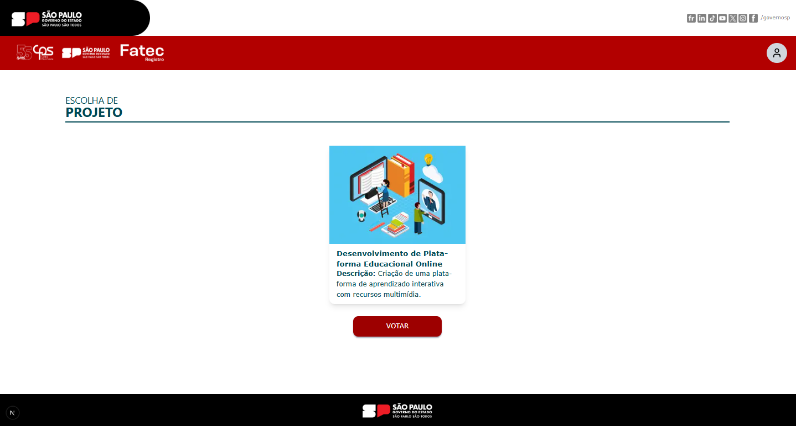
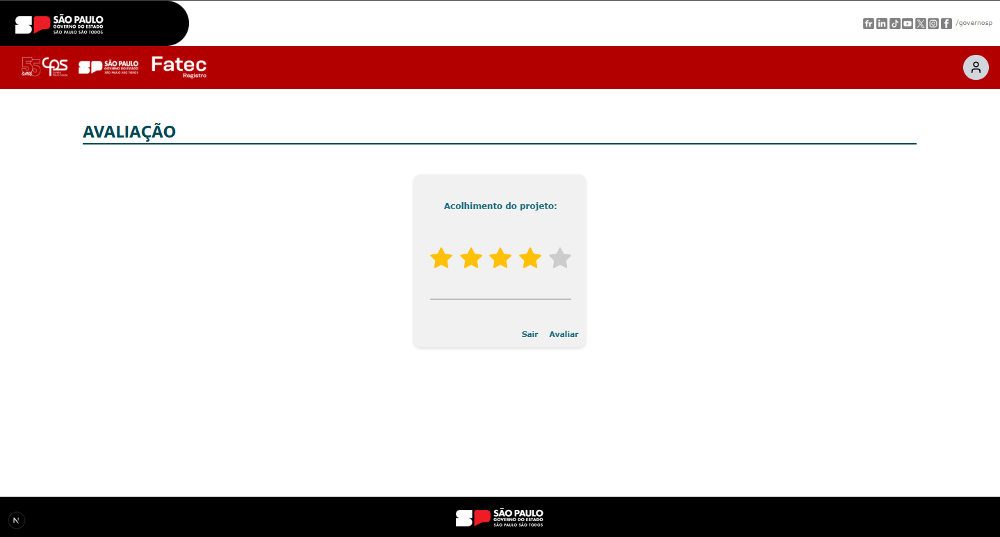
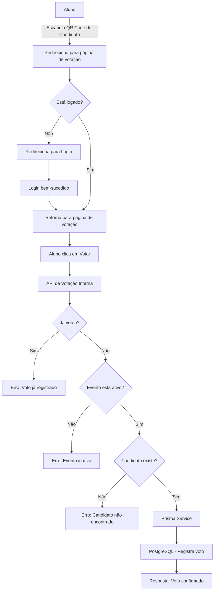
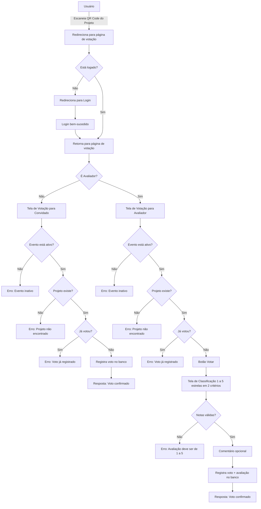
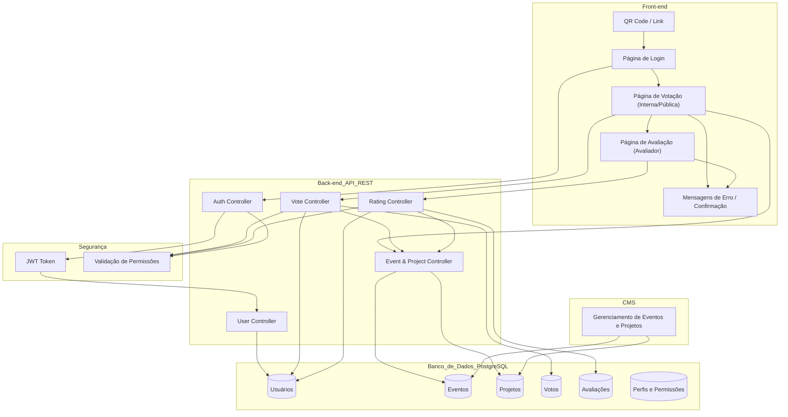
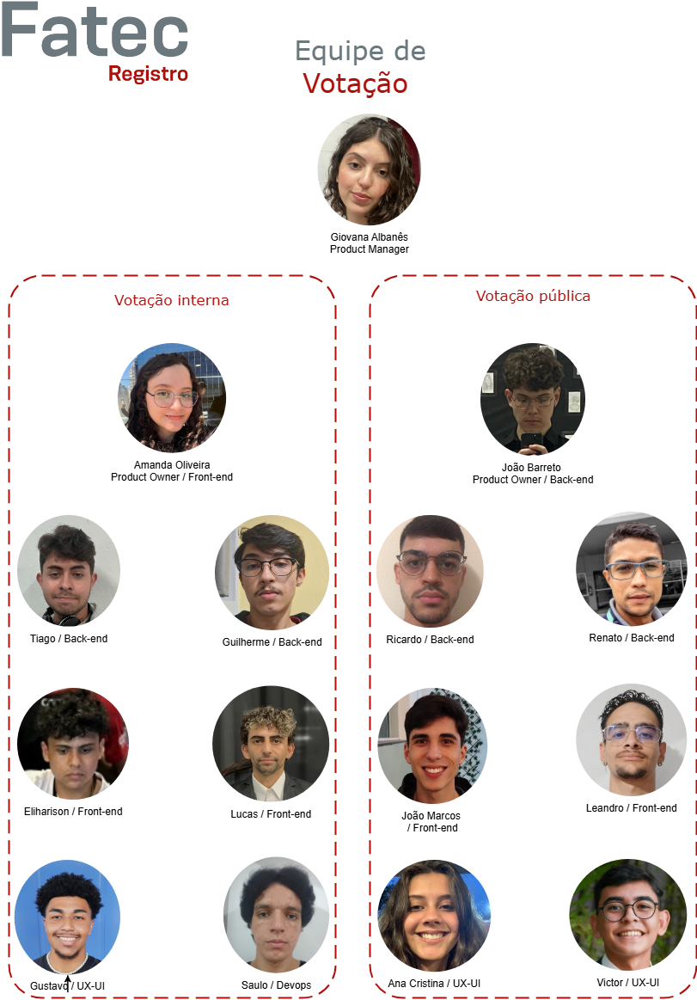

<p align="center">
  <a href="https://fatecregistro.cps.sp.gov.br/" target="blank"></a>
</p>

  <p align="center">Laboratório de Práticas é de realização da <a href="https://fatecregistro.cps.sp.gov.br/" target="_blank">Fatec Registro</a> com o objetivo de acrescentar aos alunos um portfólio, e não menos importante, experiência!</p>
    <p align="center">
<a href="https://www.instagram.com/fatecregistro/" target="_blank"></a>
</p>

<h1 align="center">Votação</h1>

## 📖 Descrição do Projeto

Este projeto consiste no desenvolvimento de um sistema de votação para a faculdade, permitindo dois tipos de votação:

- **Votação interna e segura** para escolha de representantes de turma.
<center>

</center>

- **Votação pública** para eleger o melhor projeto das feiras tecnológicas **FTX e HubTec**.
<div style="display: flex; justify-content: center; gap: 10px;">
    
    
</div>

O sistema deve ser seguro, acessível e funcional tanto para usuários internos (alunos e professores) quanto para o público externo. Além disso, o sistema contará com **dashboards e relatórios** detalhados para garantir transparência e permitir auditorias.

## Índice
- [Descrição do Projeto](#-descrição-do-projeto)

## 🛠️ Tecnologias e Ferramentas Utilizadas
**Front end:**
- JavaScript | React.js | Next.js | Tailwind | ESLint | npm | Docker
**Back end:**
- NestJS | Prisma | PostgreSQL | TypeScript | Swagger | Jest | ESLint | Prettier | npm | Docker

## ⚙️ Como Rodar a Votação

### 🔧 Pré-requisitos com Docker

- [**Git**](https://git-scm.com/downloads)
- [**Docker**](https://www.docker.com)

#### 🚀 Instalação e Execução

1. Clone os repositórios
    ```bash
    git clone https://github.com/laboratorio-de-praticas/votacao-fe.git
    git clone https://github.com/laboratorio-de-praticas/votacao-be.git
    ```

2. Acesse a pasta dos projetos 
    ```bash
    cd votacao-fe
    cd votacao-be
    ```

3. Instale as dependências em ambos:
   ```bash
   npm install
   ```

4. Crie um arquivo .env seguindo o exemplo do `.env-example` no `votacao-be`
    ```bash
    DATABASE_URL=
    FRONTEND_URL=
    PORT=
    POSTGRES_USER=
    POSTGRES_PASSWORD=
    POSTGRES_DB=
    ```

3. Crie o Container
    ```bash
    docker compose up
    ```

### 🔧 Pré-requisitos sem Docker

Antes de começar, certifique-se de ter instalado:

- [**Git**](https://git-scm.com/downloads)
- [**Node.js**](https://nodejs.org/)
- [**PostgreSQL**](https://www.postgresql.org)

#### 🚀 Instalação e Execução

1. Clone o repositório:
   ```bash
   git clone https://github.com/laboratorio-de-praticas/votacao-fe.git
   git clone https://github.com/laboratorio-de-praticas/votacao-be.git
   ```

#### Front end
2. Acesse a pasta do projeto
    ```bash
    cd votacao-fe
    ```

3. Instale as dependências:
   ```bash
   npm install
   ```

4. Rodar o sistema em ambiente de desenvolvimento:
   ```bash
   npm run dev
   ```

O sistema estará rodando em `http://localhost:3000`.

#### Back end
2. Acesse a pasta do projeto
    ```bash
    cd votacao-fe
    ```

3. Instale as dependências:
   ```bash
   npm install
   ```
4. Crie um arquivo .env seguindo o exemplo do `.env-example` 
    ```bash
    DATABASE_URL=
    FRONTEND_URL=
    PORT=
    POSTGRES_USER=
    POSTGRES_PASSWORD=
    POSTGRES_DB=
    ```

5. Copie o conteúdo presente no arquivo `prisma`->`init.sql` 
6. Crie um banco chamado `votacao_db` no PgAdmin
7. Cole no `Query Tool` a query do `init.sql`
8. Volte para o VSCode e rode prisma generate
    ```base
    npx prisma generate
    ```

9. Agora com o back e o front rodando, acesse `http://localhost:3000` e tente votar!

## 🔍 Entendendo o Sistema

### 🎓 Votação dos Representantes

- Candidatos se inscrevem no sistema com o e-mail institucional.
- Apenas alunos da mesma turma podem votar (cada aluno pode votar apenas em um candidato).
- Candidatos indicam sua turma de ingresso ao se inscreverem.
- Após a inscrição, a candidatura ficará pendente até aprovação pelos superiores.

### 🏆 Votação dos Projetos por Visitantes

- Visitantes deverão fazer um **check-in** na recepção da feira com seu telefone.
- Para votar, o visitante informará seu telefone para validação.
- A votação será feita através de um **QR Code** disponível na bancada de cada equipe.
- Cada visitante poderá votar em quantos projetos quiser, desde que seja apenas **um** voto por projeto.

### 🏆 Votação dos Projetos por Avaliadores Externos

O avaliador deve avaliar 2 critéios:
- **Projeto acolhedor** (classificação de 1 a 5 estrelas)
- **Projeto inovador** (classificação de 1 a 5 estrelas)

Além disso, o avaliador pode deixar um comentário opcional.

### 🗳️ Tela de Votação
- Para aluno e convidado, a tela conterá apenas o botão "Votar".
- Para avaliador, além do botão de votar, será necessário responder os dois critérios de avaliação com a classificação de 1 a 5 estrelas e um comentário opcional.

## Arquitetura
### Estrutura de Pastas Front end
```plaintext
votacao-fe/
├── node_modules/               # Dependências do projeto
├── public/                     # Arquivos públicos (imagens, ícones, etc.)
├── src/                        # Código-fonte principal
│   ├── app/                    # Páginas e rotas do Next.js
│   │   ├── votacao/            # Rotas relacionadas à votação
│   │   │   ├── interna/        # Fluxo de votação interna
│   │   │   │   ├── confirmacao[idEvento][idCandidato]/
│   │   │   │   │   └── page.js
│   │   │   │   └── page.js
│   │   │   ├── publica/        # Fluxo de votação pública
│   │   │   │   ├── confirmacao[idTypeVotacao][idEvento][idProjeto][idPessoa]/
│   │   │   │   │   ├── classificacao/
│   │   │   │   │   │   └── page.js
│   │   │   │   │   └── page.js
│   │   │   │   └── page.js
│   │   │   └── page.js
│   │   ├── favicon.ico         # Ícone do site
│   │   ├── globals.css         # Estilos globais
│   │   ├── layout.js           # Layout principal
│   │   ├── not-found.js        # Página de erro 404
│   │   └── page.js             # Página inicial
│   ├── components/             # Componentes reutilizáveis
│   └── middleware.js           # Middleware para manipulação de rotas
├── .env.example                # Exemplo de variáveis de ambiente
├── .env.local                  # Variáveis de ambiente locais
├── .gitignore                  # Arquivos ignorados pelo Git
├── compose.yml                 # Configuração do Docker Compose
├── Dockerfile                  # Configuração do Docker
├── eslint.config.mjs           # Configuração do ESLint
├── jsconfig.json               # Configuração do JavaScript
├── next.config.mjs             # Configuração do Next.js
├── package.json                # Dependências e scripts do projeto
├── package-lock.json           # Lockfile do npm
├── postcss.config.mjs          # Configuração do PostCSS
└── README.md                   # Documentação do projeto
```
### Estrutura de Pastas Back end
```plaintext
votacao-be/
├── prisma/                     # Configurações e scripts do Prisma
│   ├── schema.prisma           # Esquema do banco de dados
│   ├── init.sql                # Script de inicialização do banco
├── src/                        # Código-fonte principal
│   ├── app.module.ts           # Módulo raiz da aplicação
│   ├── main.ts                 # Arquivo de inicialização do NestJS
│   ├── prisma/                 # Serviço do Prisma
│   │   ├── prisma.module.ts    # Módulo do Prisma
│   │   ├── prisma.service.ts   # Serviço do Prisma
│   ├── votacao/                # Módulo de votação
│   │   ├── interna/            # Fluxo de votação interna
│   │   │   ├── interna.module.ts
│   │   │   ├── interna.service.ts
│   │   │   ├── interna.controller.ts
│   │   │   └── dto/            # DTOs para validação
│   │   │       ├── criar-voto.dto.ts
│   │   │       ├── verificar-voto.dto.ts
│   │   ├── publica/            # Fluxo de votação pública
│   │   │   ├── publica.module.ts
│   │   │   ├── publica.service.ts
│   │   │   ├── publica.controller.ts
│   │   │   └── dto/            # DTOs para validação
│   │   │       ├── criar-voto-avaliador.dto.ts
│   │   │       ├── criar-voto-visitante.dto.ts
│   │   │       ├── verificar-voto-avaliador.dto.ts
│   │   │       ├── verificar-voto-visitante.dto.ts
├── test/                       # Testes automatizados
│   ├── app.e2e-spec.ts         # Testes end-to-end
│   ├── jest-e2e.json           # Configuração do Jest para testes e2e
├── .env.example                # Exemplo de variáveis de ambiente
├── .gitignore                  # Arquivos ignorados pelo Git
├── .prettierrc                 # Configuração do Prettier
├── docker-compose.yaml         # Configuração do Docker Compose
├── Dockerfile                  # Configuração do Docker
├── nest-cli.json               # Configuração do NestJS CLI
├── package.json                # Dependências e scripts do projeto
├── tsconfig.json               # Configuração do TypeScript
├── tsconfig.build.json         # Configuração do TypeScript para build
└── README.md                   # Documentação do projeto
```

### 🔄 Fluxo de Dados

#### 1. **Votação Interna (Representantes de Turma)**



#### 2. **Votação Pública (Projetos FTX/HubTec)**




#### Componentes Envolvidos:
- **Frontend**: Interface para alunos, visitantes e administradores.
- **API**: Endpoints desenvolvidos em NestJS para gerenciar os fluxos de votação.
- **Prisma ORM**: Gerenciamento e abstração do banco de dados PostgreSQL.
- **Banco de Dados**: PostgreSQL para armazenamento de dados de usuários, votos, eventos e projetos.

Esses fluxos descrevem como os dados são processados e armazenados no sistema, garantindo integridade e validação em cada etapa.

### 🏗️ Diagrama de Arquitetura



## 📖 Documentação da API

### 📍 Endpoints

#### **Votação Pública**

1. **Registrar Voto do Visitante**
   - **URL**: `POST /votacao/publica/confirmacao/visitante`
   - **Descrição**: Registra o voto de um visitante em um projeto específico dentro de um evento.
   - **Body**:
     ```json
     {
       "id_visitante": 1,
       "id_projeto": 10,
       "id_evento": 100
     }
     ```
   - **Respostas**:
     - `201`: Voto registrado com sucesso.
     - `400`: Erro na validação dos dados.

2. **Verificar Voto do Visitante**
   - **URL**: `GET /votacao/publica/confirmacao/visitante/:idVisitante/:idProjeto/:idEvento`
   - **Descrição**: Verifica se um visitante já votou em um projeto específico dentro de um evento.
   - **Parâmetros**:
     - `idVisitante`: ID do visitante.
     - `idProjeto`: ID do projeto.
     - `idEvento`: ID do evento.
   - **Respostas**:
     - `200`: Status do voto retornado com sucesso.
     - `400`: Parâmetros obrigatórios ausentes ou inválidos.

3. **Obter Detalhes de um Projeto**
   - **URL**: `GET /votacao/publica/confirmacao/detalhes/:id_projeto`
   - **Descrição**: Retorna os detalhes de um projeto, incluindo informações relevantes e integrantes.
   - **Parâmetros**:
     - `id_projeto`: ID do projeto.
   - **Respostas**:
     - `200`: Detalhes do projeto retornados com sucesso.
     - `400`: Projeto não encontrado.

4. **Registrar Classificação de um Avaliador**
   - **URL**: `POST /votacao/publica/confirmacao/avaliador/classificacao`
   - **Descrição**: Permite que um avaliador registre uma classificação de estrelas para um projeto.
   - **Body**:
     ```json
     {
       "id_avaliador": 2,
       "id_projeto": 2,
       "id_evento": 2,
       "estrelas_inovador": 4,
       "estrelas_acolhedor": 4,
       "comentario": "Ótimo projeto!"
     }
     ```
   - **Respostas**:
     - `201`: Classificação registrada com sucesso.
     - `400`: Erro na validação dos dados.

5. **Verificar Voto do Avaliador**
   - **URL**: `GET /votacao/publica/confirmacao/avaliador/:idAvaliador/:idProjeto/:idEvento`
   - **Descrição**: Verifica se um avaliador já votou em um projeto específico dentro de um evento.
   - **Parâmetros**:
     - `idAvaliador`: ID do avaliador.
     - `idProjeto`: ID do projeto.
     - `idEvento`: ID do evento.
   - **Respostas**:
     - `200`: Status do voto retornado com sucesso.
     - `400`: Parâmetros obrigatórios ausentes ou inválidos.

---

#### **Votação Interna**

1. **Registrar Voto do Aluno**
   - **URL**: `POST /votacao/interna/confirmacao`
   - **Descrição**: Registra o voto de um aluno em um representante dentro de um evento específico.
   - **Body**:
     ```json
     {
       "idAluno": 1,
       "idRepresentante": 1,
       "idEvento": 1
     }
     ```
   - **Respostas**:
     - `201`: Voto registrado com sucesso.
     - `400`: Erro de validação nos dados enviados.

2. **Verificar Voto do Aluno**
   - **URL**: `GET /votacao/interna/confirmacao/verificacao/:idAluno/:idEvento`
   - **Descrição**: Verifica se um aluno já votou em um evento interno.
   - **Parâmetros**:
     - `idAluno`: ID do aluno.
     - `idEvento`: ID do evento.
   - **Respostas**:
     - `200`: Status do voto retornado com sucesso.
     - `400`: Parâmetros obrigatórios ausentes ou inválidos.

3. **Obter Detalhes de um Representante**
   - **URL**: `GET /votacao/interna/representante/:id_representante`
   - **Descrição**: Retorna informações básicas de um representante, como nome, foto, curso e situação.
   - **Parâmetros**:
     - `id_representante`: ID do representante.
   - **Respostas**:
     - `200`: Detalhes do representante retornados com sucesso.
     - `400`: Representante não encontrado.

---

### Swagger
Acesse a documentação interativa da API no Swagger:
- **URL**: [http://localhost:3000/api](http://localhost:3000/api)

## 📝 Licença

Este projeto está licenciado sob a licença **MIT**. Isso significa que você pode usar, copiar, modificar, mesclar, publicar, distribuir, sublicenciar e/ou vender cópias do software, desde que mantenha o aviso de copyright original. Para mais detalhes, consulte o arquivo [LICENSE](./LICENSE).

---

## 👥 Autores


---


📌 **Desenvolvido para proporcionar uma votação segura e transparente!**